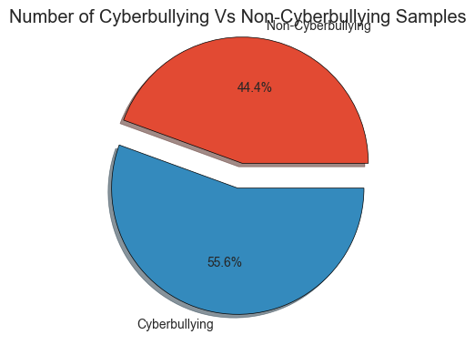

# Intelligent Cyberbullying Identification in Bangla-Texts

A supervised machine learning framework designed to detect and classify offensive content in Bengali social media text. This project implements a complete NLP pipeline, from custom data preprocessing to hyperparameter tuning of multiple classification algorithms.

---

## Features
* **Custom Dataset:** Processed 4,501 annotated samples with a balanced distribution (~55% Hateful, ~45% Neutral).
* **Specialized Preprocessing:** Regex-based cleaning to isolate Bengali Unicode characters and normalize whitespace.
* **Stopword Removal:** Integration of a custom `bangla_stopwords.csv` for improved feature relevance.
* **Vectorization:** Text-to-feature conversion using **TF-IDF Vectorization**.
* **Model Benchmarking:** Comparative analysis of 7 different algorithms including SVM, Logistic Regression, and Ensemble methods.
* **Hyperparameter Tuning:** Implementation of `GridSearchCV` to optimize the best-performing model.

---

## Technical Pipeline

1.  **Data Loading & Label Mapping:** Converts categorical labels ("Hateful", "Neutral") into binary targets (1, 0).

2.  **Exploratory Data Analysis (EDA):** Visualizes class distribution using Matplotlib pie charts.
3.  **Text Cleaning:** Uses `re` (Regex) to strip non-Bengali characters, ensuring the model focuses strictly on language patterns.
4.  **Feature Extraction:** Utilizes `TfidfVectorizer` to transform cleaned text into numerical matrices.
5.  **Model Training:** Evaluates the following algorithms:
    * Linear SVC
    * Logistic Regression
    * Multinomial Naive Bayes
    * Decision Tree
    * AdaBoost & Bagging Classifiers
    * Stochastic Gradient Descent (SGD)
6.  **Persistence:** Saves trained models and vectorizers using `pickle` for real-time inference.

---

## Performance Metrics
The system evaluates models based on **Accuracy**, **F1-Score**, **Precision**, and **Recall**. 

The project includes a visualization script that generates a comparison bar chart of all tested algorithms to identify the most reliable model for Bengali text classification.

---
## 🛠️ Tech Stack

* **Language:** Python 3.x
* **Libraries:** Pandas, NumPy, Matplotlib, Seaborn, Scikit-learn
* **Serialization:** Pickle

---
